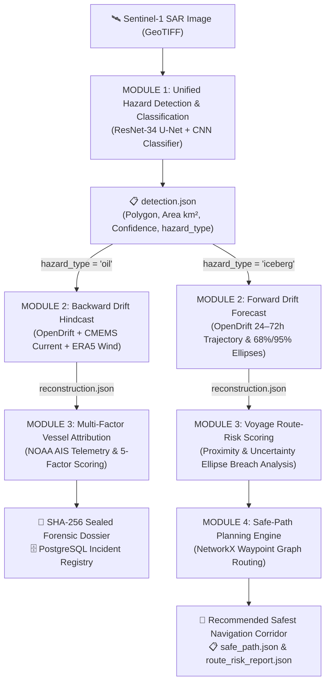

# 🌊 OceanTrace (Ocean-Trace-v3.0)

<div align="center">

[](https://python.org)
[](https://fastapi.tiangolo.com)
[](https://pytorch.org)
[](https://opendrift.github.io)
[](https://networkx.org)
[](https://vitejs.dev)
[](LICENSE)

**Unified Satellite SAR Hazard Intelligence: Oil Spill Detection & Vessel Attribution + Antarctic Iceberg Trajectory & Navigation Decision Support**

*Smart India Hackathon 2026 — Problem Statement SIH26059*  
*Ministry of Earth Sciences (MoES) / National Centre for Polar and Ocean Research (NCPOR)*

</div>

---

## 🧭 About the Project

**OceanTrace** is an end-to-end maritime hazard intelligence platform built around a central insight: a satellite Synthetic Aperture Radar (SAR) image does not arrive pre-labeled with the nature of the anomaly it detects. 

OceanTrace detects marine oil slicks and Antarctic icebergs through the same Sentinel-1 SAR imagery pipeline, automatically classifies the hazard type, and branches dynamically into dedicated physical modeling and decision-support engines:
- **Oil Spills (`hazard_type = "oil"`)** $\longrightarrow$ Backward Lagrangian physics hindcasting (CMEMS/ERA5) + AIS multi-factor vessel attribution + SHA-256 sealed forensic evidence reports.
- **Icebergs (`hazard_type = "iceberg"`)** $\longrightarrow$ Forward drift trajectory forecasting + $68\% / 95\%$ confidence ellipse dispersion modeling + NetworkX shortest-path safe navigational planning.

> [!IMPORTANT]
> **The Problem Solved:** When a ship illegally discharges oil or suffers an accident at sea, the slick drifts rapidly with currents and winds; by the time a satellite observes it, the responsible vessel may be hundreds of nautical miles away. Conversely, vessels navigating polar waters frequently rely on stale, coarse ice charts instead of live, trajectory-aware hazard avoidance. OceanTrace converts raw radar anomalies into **fast, explainable, actionable decisions**.

---

## 🔄 End-to-End System Workflow



---

## 🔬 Explainable Architecture Breakdown

OceanTrace's pipeline is divided into **4 distinct, contract-driven stages**, structured so every decision is fully auditable and justified by physical evidence:

```text
 ┌────────────────────────────────────────────────────────────────────────────────────────┐
 │                              STAGE 1: DETECTION & CLASSIFICATION                       │
 │  Sentinel-1 SAR (.tif) ──► ResNet-34 U-Net (Segmentation) ──► CNN Hazard Classifier   │
 │                            └── Output: detection.json (Polygon + hazard_type)          │
 └───────────────────────────────────────────┬────────────────────────────────────────────┘
                                             │
                      ┌──────────────────────┴──────────────────────┐
                      ▼                                             ▼
 ┌───────────────────────────────────────────┐ ┌──────────────────────────────────────────┐
 │       BRANCH A: OIL SPILL FORENSICS       │ │     BRANCH B: ICEBERG SAFETY & ROUTE     │
 │                                           │ │                                          │
 │ 1. Module 2: Backward Drift Hindcast      │ │ 1. Module 2: Forward Drift Forecast      │
 │    • OpenOil particle back-propagation    │ │    • OceanDrift forward trajectory sim   │
 │    • CMEMS ocean currents + ERA5 winds    │ │    • 24–72h forecast + 68%/95% ellipses  │
 │                                           │ │                                          │
 │ 2. Module 3: 5-Factor Vessel Attribution  │ │ 2. Module 3: Voyage Route-Risk Scoring   │
 │    • NOAA AIS telemetry temporal query    │ │    • Planned route segment analysis      │
 │    • Transparent explainable ranking:     │ │    • Uncertainty buffer penetration test │
 │      - Spatial Proximity (0.30)           │ │    • Verdict: Low / Medium / High        │
 │      - Temporal Overlap (0.20)            │ │                                          │
 │      - Trajectory Consistency (0.20)      │ │ 3. Module 4: Safe-Path Planning Engine   │
 │      - Drift Consistency (0.20)           │ │    • NetworkX waypoint graph mesh        │
 │      - Speed/Course Behavior (0.10)       │ │    • Dynamic hazard barrier penalties    │
 │                                           │ │    • Dijkstra optimal safe bypass route  │
 │ 3. Output: Legal Forensic Incident Report │ │                                          │
 │    • SHA-256 cryptographic tamper seal    │ │ 4. Output: Navigational Decision Dossier │
 │    • QR-verifiable incident certificate   │ │    • Recommended waypoint sequence       │
 │    • PostgreSQL incident database record  │ │    • safe_path.json & route_risk_report  │
 └───────────────────────────────────────────┘ └──────────────────────────────────────────┘
```

### 1️⃣ Module 1 — Unified Hazard Detection & Classification
* **SAR Segmentation (`model.py`):** Pre-trained ResNet-34 U-Net processes single-band or dual-polarization Sentinel-1 radar backscatter (dB / linear) and segments dark oil slicks or bright scatterers.
* **Hazard-Type Classification (`iceberg_classifier.py`):** A dedicated classifier tags each detection as `oil`, `iceberg`, or `false_alarm`.
* **Look-Alike & Coastal Filtering:** Applies a 5 km coastal exclusion mask and minimum surface area thresholds to reject false positives from shorelines, mudflats, and calm wind shadows.
* **Output Contract:** Produces `detection.json` containing the GeoJSON boundary polygon, surface area ($\text{km}^2$), detection confidence, and `hazard_type`.

### 2️⃣ Branch A — Oil Spill Forensic Reconstruction
* **Module 2: Backward Drift Hindcast (`source_reconstruction.py`):** Seeds 1,000 Lagrangian particles inside the observed slick polygon and propagates them **backward in time** (up to 72 hours) against historical CMEMS surface currents and ERA5 10m wind fields to calculate the probable release point and 1-sigma spatial covariance uncertainty ellipse.
* **Module 3: Multi-Factor Vessel Attribution (`evidence_fusion.py`):** Queries regional AIS ship records and scores suspect vessels across 5 explainable parameters:
  $$\text{Score} = 0.30 \cdot S_{\text{prox}} + 0.20 \cdot S_{\text{time}} + 0.20 \cdot S_{\text{traj}} + 0.20 \cdot S_{\text{drift}} + 0.10 \cdot S_{\text{behavior}}$$
* **Court-Ready Forensic Report:** Generates an incident dossier with an auditable calculation breakdown, SHA-256 tamper-evident seal, and QR-verifiable case ID.

### 3️⃣ Branch B — Antarctic Iceberg Trajectory & Navigation Decision Support
* **Module 2: Forward Drift Forecasting (`iceberg_forecast.py`):** Simulates forward iceberg drift (24h–72h) using OpenDrift `OceanDrift` with iceberg-specific wind-drag coefficients ($3.5\%$ windage), calculating hourly trajectory centroids and dynamic $68\%$ and $95\%$ confidence ellipses.
* **Module 3: Route-Risk Scoring (`route_risk.py`):** Takes a vessel's planned voyage waypoints and scores each leg by its minimum clearance to the forecasted iceberg and whether it penetrates the $68\%$ or $95\%$ dispersion envelopes.
* **Module 4: Safe-Path Planning Engine (`safe_path.py`):** Employs **NetworkX graph routing** over the voyage area. Edges crossing within iceberg uncertainty envelopes receive prohibitive barrier cost penalties, allowing Dijkstra shortest-path optimization to discover the lowest-risk safe passage corridor.

---

## 🤔 Why Oil Spills and Icebergs in One Platform?

This is not two disparate projects merged together — it is a deliberate architectural unification grounded in radar physics and oceanographic modeling:

* 🎯 **Shared False-Positive Problem, Solved Once:** In satellite SAR literature, icebergs and oil slicks are primary documented look-alikes — both alter backscatter relative to open water. A detection filter trained to distinguish slicks from look-alikes is already equipped to classify icebergs as a hazard in their own right, preserving critical safety intelligence.
* 🌊 **Shared Ocean Physics Engine:** OpenDrift models the transport and dispersion of floating objects under environmental forcing (currents, Stokes drift, winds). Running it backward (hindcasting release origin) and forward (forecasting iceberg drift) utilizes the same unified numerical framework.
* 🛡️ **Unified Operational Command:** Coast guards, maritime safety agencies, and research expedition planners require a single operational picture rather than fragmented single-hazard utilities.
* 🌐 **Converging Polar Risk:** As polar shipping routes open due to retreating sea ice, commercial and scientific vessels face simultaneous oil-spill risks and iceberg collision hazards in identical waterways.

---

## 🎯 Target Users & Operational Scenarios

| User / Stakeholder | 🧊 Iceberg Safety Use Case | 🛢️ Oil Spill Forensic Use Case |
| :--- | :--- | :--- |
| **Ministry of Earth Sciences / NCPOR / Indian Antarctic Programme** | Live sea-ice tracking, drift forecasting, and route optimization for *Bharati* & *Maitri* research station resupply voyages. | Environmental monitoring of polar and sub-polar maritime routes. |
| **Research Vessel Captains & Expedition Planners** | Explainable voyage collision risk scoring and dynamic waypoint re-routing around forecasted iceberg fields. | Rapid reporting of offshore spills in fragile ecological zones. |
| **Coast Guards & Maritime Authorities (ICG / USCG / EMSA)** | Polar/sub-polar monitoring and surveillance along high-latitude shipping corridors. | Rapid detection of offshore pollution events, slick origin tracing, and forensic dossiers for enforcement. |
| **Environmental Protection Agencies & PCBs** | Environmental impact assessment of changing iceberg drift patterns. | Accountability for illegal bilge/sludge dumps and quantification of slick extent. |
| **Port & Harbor Authorities** | Coastal approach surveillance during winter freeze cycles. | Monitoring near-shore anchorage zones, pipelines, and vessel compliance. |

---

## ✨ Key Features & Capabilities

* 🛰️ **Deep Learning SAR Segmentation:** ResNet-34 U-Net trained on Sentinel-1 SAR imagery using a custom Hybrid Focal Tversky loss to resolve extreme class imbalance and isolate true hazards from calm-water look-alikes.
* 🧠 **Hazard-Type Classification:** Lightweight CNN classifier trained on labeled SAR chips (Statoil/C-CORE dataset) providing instant tagging (`oil`, `iceberg`, `false_alarm`).
* 🔄 **Dual-Direction Lagrangian Drift Simulation:**
  * **Backward Hindcast:** Reconstructs historical spill origins up to 72 hours in the past using real CMEMS currents and ERA5 wind forcing.
  * **Forward Forecast:** Forecasts iceberg drift 24–72 hours forward, generating step-by-step $68\%$ and $95\%$ spatial uncertainty ellipses.
* 🚢 **Transparent 5-Factor Vessel Attribution:** Multi-factor evidence scoring evaluating candidate ships across spatial proximity, temporal overlap, trajectory consistency, drift consistency, and speed/course anomalies.
* 🧭 **Iceberg Route-Risk Scoring & Safe-Path Planning:**
  * Scores voyage waypoints (`Low`, `Medium`, `High`) with plain-language explanations.
  * Employs **NetworkX graph pathfinding** with dynamic risk-barrier penalties to synthesize the safest navigable route around multi-iceberg fields.
* 💻 **Interactive Full-Stack Web Console:** Dark-mode maritime UI with high-resolution radar previews, particle animation, ranked vessel timelines, and interactive safe route overlays.
* 🔐 **Court-Ready Forensic PDF Export:** Client-side generated incident dossier complete with a SHA-256 cryptographic hash and QR-verifiable case ID.
* 🗄️ **Persistent Database Registry:** Automatic incident archiving and vessel registry lookups backed by PostgreSQL / PostGIS.

---

## 🏗️ Architecture & Design Principles

> [!TIP]
> **Additive & Non-Destructive Extension:** Iceberg detection, forward drift forecasting, route-risk scoring, and Module 4 safe path planning were designed and implemented as clean, modular extensions without modifying existing oil-spill weights, model logic, or core contract adapters.

* **Contract-Driven Decoupling:** Modules communicate through versioned JSON schemas (`detection.json`, `reconstruction.json`, `route_risk_report.json`, `safe_path.json`).
* **Real-World Validation Data:** Validated against real Sentinel-1 SAR scenes (e.g. post-Hurricane Ida Gulf of Mexico incident) and 264,646 NOAA MarineCadastre AIS vessel records.
* **Explainability First:** All scoring systems provide transparent numerical component weights and structured natural-language rationale.
* **Rigorous False-Positive Suppression:** Integrated 5 km coastal exclusion buffers and minimum surface area thresholds to eliminate near-shore radar artifacts.

---

## 🔒 Security & Best Practices

* **Zero Hardcoded Secrets:** Credentials, tokens, and database URIs are loaded strictly from environment variables (`.env`).
* **Safe Database Access:** Parameterized queries across all PostgreSQL database operations.
* **Schema Validation:** Strict Pydantic input models validating all API requests before execution.
* **SAR Image Verification:** Pre-inference sanity checks verifying GeoTIFF SAR characteristics and backscatter ranges.
* **Tamper-Evident Dossiers:** SHA-256 hash sealing on generated evidence certificates.

---

## 🚀 Setup & Execution Guide

### 📋 Prerequisites
* **Python 3.10+** ([python.org](https://www.python.org/downloads/))
* **Node.js 18+ & npm** ([nodejs.org](https://nodejs.org/))
* **Git** ([git-scm.com](https://git-scm.com/downloads))
* *PostgreSQL (optional — only required for persistent database storage)*

---

### Step 1 — Clone the Repository
```bash
git clone https://github.com/senvidit4-alt/Ocean_Trace_v.3.0_.git
cd Ocean_Trace_v.3.0_
```

### Step 2 — Backend Setup (FastAPI & Drift Engine)

**Windows (PowerShell):**
```powershell
# 1. Create Python virtual environment
python -m venv venv

# 2. Allow execution in current session
Set-ExecutionPolicy -Scope Process -ExecutionPolicy Bypass

# 3. Activate virtual environment
.\venv\Scripts\Activate.ps1

# 4. Install dependencies
pip install -r requirements.txt

# 5. Start the backend server
python main.py
```

**Linux / macOS:**
```bash
# 1. Create Python virtual environment
python3 -m venv venv

# 2. Activate virtual environment
source venv/bin/activate

# 3. Install dependencies
pip install -r requirements.txt

# 4. Start the backend server
python3 main.py
```

* 🚀 **Backend Live At:** `http://localhost:8000`
* 📖 **Interactive Swagger Docs:** `http://localhost:8000/docs`
* 🩺 **Health Check:** `http://localhost:8000/api/health`

---

### Step 3 — Frontend Setup (Maritime UI Console)

Open a new terminal window:
```bash
cd ocean-trace-frontend
npm install
npm run dev
```

* 🖥️ **Web Console Live At:** `http://localhost:5173`

---

### Step 4 — (Optional) Database Initialization

```bash
cp .env.example .env
# Configure your PostgreSQL credentials in .env
python report_db.py
```

---

## 🧪 Automated Testing & Verification

Run the full end-to-end integration and API test suite:
```bash
python test_backend_api.py
```

Run iceberg forward drift forecasting tests:
```bash
python modules/02_drift/tests/test_iceberg_forecast.py
```

Run route-risk scoring and safe-path planning tests:
```bash
python modules/04_navigation/tests/test_safe_path_and_risk.py
```

Run CLI full-pipeline runner (Oil Spill path):
```bash
python run_pipeline.py --input-synthetic --output-dir outputs
```

---

## 📁 Repository Structure

```text
Ocean_Trace_v.3.0_/
├── backend/
│   ├── __init__.py
│   └── main.py                     # FastAPI REST API endpoints
├── ocean-trace-frontend/           # Interactive Web UI Console (Vite + Vanilla JS)
│   ├── index.html                  # Geospatial map interface
│   ├── src/styles.css              # Dark-mode glassmorphic styling
│   ├── vite.config.js              # Vite server & proxy configuration
│   └── package.json
├── modules/
│   ├── 01_detection/               # Module 1: Hazard Detection & Classification
│   │   └── src/
│   │       ├── model.py            # ResNet-34 U-Net architecture
│   │       ├── iceberg_classifier.py # Hazard classifier (Oil / Iceberg / False Alarm)
│   │       ├── data_loader.py
│   │       ├── train.py
│   │       └── validation.py
│   ├── 02_drift/                   # Module 2: Lagrangian Drift Physics
│   │   └── src/
│   │       ├── source_reconstruction.py # Backward spill hindcast
│   │       └── iceberg_forecast.py      # Forward iceberg forecast
│   ├── 03_attribution/             # Module 3: Attribution & Risk Evaluation
│   │   └── src/
│   │       ├── evidence_fusion.py  # 5-factor vessel attribution
│   │       └── route_risk.py       # Planned route collision risk scoring
│   └── 04_navigation/              # Module 4: Safe Passage Planning
│       └── src/
│           └── safe_path.py        # NetworkX graph shortest-path router
├── data/
│   ├── AIS_*.csv                   # Real Gulf of Mexico AIS telemetry dataset
│   └── samples/                    # Sample GeoTIFF scenes & netCDF files
├── contracts/                      # Inter-module JSON schema specifications
├── docs/                           # Architecture documentation & design specs
├── requirements.txt                # Python package dependencies
├── run_pipeline.py                 # Full CLI pipeline runner
├── test_backend_api.py             # Integration test suite
├── .env.example                    # Environment variable template
└── main.py                         # Root entrypoint
```

---

## ⚙️ REST API Endpoints

| Method | Endpoint | Module | Description |
| :--- | :--- | :--- | :--- |
| `GET` | `/health` | Core | System health check and module readiness probe. |
| `POST` | `/detect-spill` | Module 1 | Detects hazard anomalies, produces polygon, confidence, and `hazard_type`. |
| `POST` | `/trace-origin` | Module 2 (Oil) | Runs backward drift hindcast to estimate release origin centroid and uncertainty. |
| `POST` | `/attribute-vessel` | Module 3 (Oil) | Evaluates candidate vessels against reconstructed release trajectory. |
| `POST` | `/score-route-risk` | Module 3 (Iceberg) | Evaluates planned voyage waypoints against forward iceberg dispersion. |
| `POST` | `/find-safe-path` | Module 4 (Iceberg) | Calculates optimal collision-free route around multi-iceberg fields. |
| `POST` | `/run-full-pipeline` | Full Pipeline | Executes complete end-to-end chain with dynamic hazard branching. |

---

## 🧰 Technology Stack

| Layer | Technology |
| :--- | :--- |
| **Deep Learning & Computer Vision** | PyTorch, `segmentation_models_pytorch`, ResNet-34, Rasterio, OpenCV, Shapely |
| **Ocean Drift & Particle Physics** | OpenDrift (`OpenOil` & `OceanDrift`), NetCDF4, xarray, CMEMS, ERA5 |
| **AIS Analytics & Graph Routing** | pandas, NumPy, GeoPandas, NetworkX, Shapely |
| **Backend & API** | FastAPI, Uvicorn, Pydantic |
| **Database** | PostgreSQL, PostGIS, psycopg2, JSONB |
| **Frontend & Visualization** | Vite, HTML5 Canvas, JavaScript, Leaflet / CartoDB base tiles |
| **Forensics & Export** | html2pdf.js, Web Crypto API (SHA-256), qrcode.js |
| **Deployment** | Render (Backend API), Vercel (Frontend Console) |

---

## 👥 Team

**Team Ocean Trace** — *Smart India Hackathon 2026*  
**Problem Statement:** SIH26059 *(Ministry of Earth Sciences / NCPOR)*  
**Repository:** [github.com/senvidit4-alt/Ocean_Trace_v.3.0_](https://github.com/senvidit4-alt/Ocean_Trace_v.3.0_)

## 📄 License

This project is licensed under the [MIT License](LICENSE).
